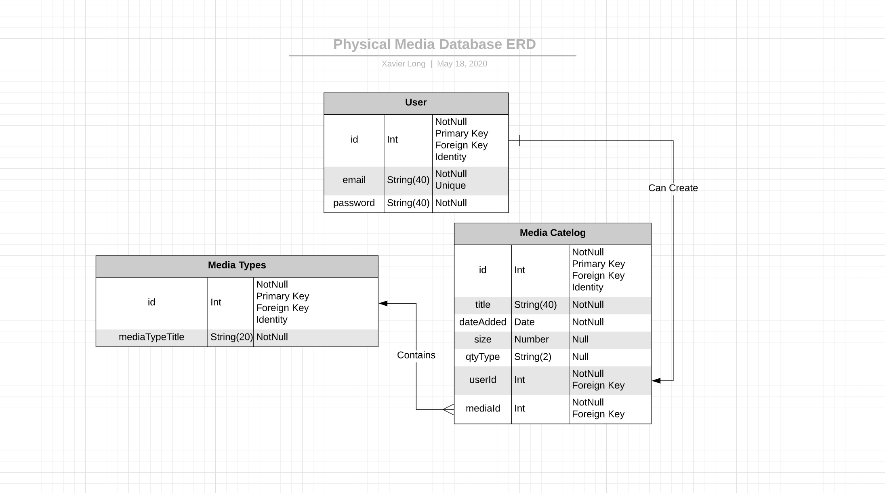

# Physical-Media-Database-Step-8 #
By Xavier L.
05/16/2020

---
### Description ###
By design this web app is a manual catelog of all physical media the user has.  

---
### Functionality ###
* Create categories of media and media entries
* Modify categories of media and media entries
* Delete categories of media and media entries
* Separated media entries by user and only you can access them

---
### Design ###
The data is stored in three tables. One containing user information, one with the media entries and one with the media categories.
For initial setup the user must provide a valid email address and password. From there the user will be greeted with a screen prompting the creation of a category or a list of existing user created categories.
Creation of the category is simple: just add the name of the category and click submit.
Once you have at least one category created and selected you can then add media entries into those categories.
You are required to have at least a title when filling out a media entry, the category is automatically generated based on the category you selected before and the media entry is saved under your account.
